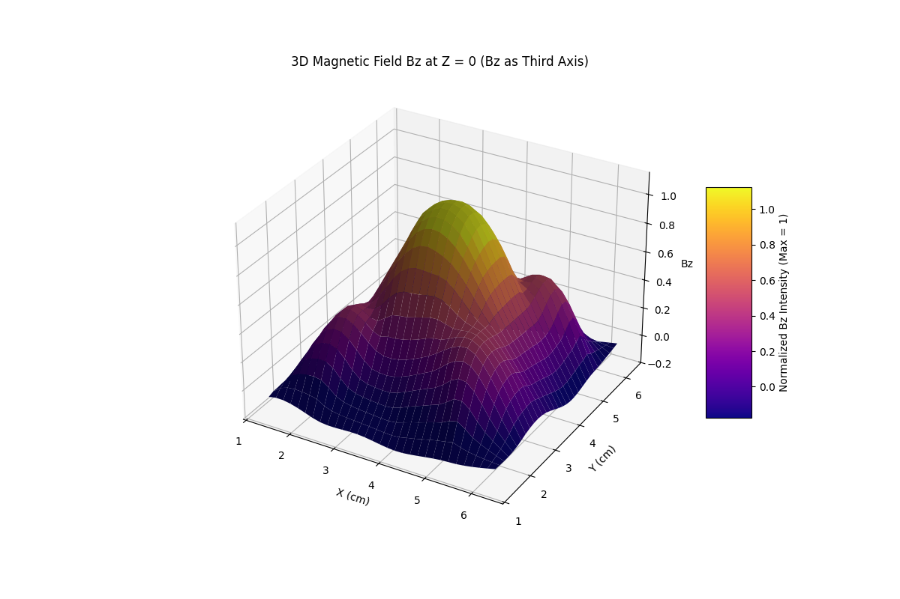

# Inductive Coil Design Automation
This repository offers utilities to automate the design of inductive coils in [KiCad](https://www.kicad.org/) format.

## Dependencies
Some version of Python 3 is needed, the code was tested with Python 3.10.

All necessary packages can be installed with:
```bash
pip install -r requirements.txt
```

## Features
There are several scripts which allow the user to create inductive coils of different shapes. The relevant scripts are detailed below:
### *main.py*
create inductive coils of different shapes
- with variable turn number, including partial turns
- with customizable outer diameter, track width, track gap, etc.
- on any layer of the PCB board

This script can either be used on its own to create one inductive coil on a PCB board and plot its magnetic field if desired; or it can be used in a script to create more complicated layouts with, similar to the examples in [this section](#ex).

#### Usage

This Python script generates an inductive coil in KiCad format, allowing customization of parameters such as the number of turns, track width, and via size. It can also plot the magnetic field of the generated coil.

Run the script from the command line with the desired parameters:

```sh
python main.py -o 50000 -w 1270 -v 7 -n 5 -g 1270 -d 500
```

This will produce a heptagonal coil with:
- **Outer diameter**: 50 mm
- **Track width**: 1.27 mm
- **Track gap**: 1.27 mm
- **Via drill size**: 0.5 mm
- **Number of turns**: 5
- **Vertices**: 7 (heptagonal shape)
and plot the coil as well as its magnetic field.

Alternatively, call the *main* function with parameters in standard python fashion without the command line. Both is supported.

#### Parameters
Here are all the arguments that can be used to customize a coil with *main.py*:

| Argument      | Short | Type  | Default | Description |
|--------------|-------|-------|---------|-------------|
| `--inner`    | `-i`  | int   | 25000   | Inner diameter (µm) |
| `--outer`    | `-o`  | int   | 50000   | Outer diameter (µm) |
| `--length`   | `-l`  | int   | 100     | Segment length (µm) |
| `--turns`    | `-n`  | float | 9       | Number of turns |
| `--width`    | `-w`  | int   | 1270    | Track width (µm) |
| `--gap`      | `-g`  | int   | 1270    | Track gap (µm) |
| `--drill`    | `-d`  | float | 0.15    | Via drill size (mm) |
| `--via_outer`|       | float | 0.25    | Outer diameter of via (mm) |
| `--straight` | `-s`  | flag  | `False` | Use straight lines instead of diagonal to connect the bottom layer to the via |
| `--vertices` | `-v`  | int   | 4       | Number of vertices (for <=2 assume circular) |
| `--pos_x`    |       | int   | 38      | X coordinate (mm) to start coil |
| `--pos_y`    |       | int   | 38      | Y coordinate (mm) to start coil |
| `--layer`    |       | str   | `"F.Cu"`| KiCad layer to place the coil on |
| `--coil_only`|       | bool  | `False` | If `True`, returns only the coil text without initializing the PCB layout |
| `--no_plots` |       | bool  | `False` | If set, disables magnetic field plotting |

When using the *main* function as part of other scripts, *--coil_only* should be enabled for all calls and the file initialized and ended separately (see [examples](#ex)), otherwise the coils will be saved in separate files (or overridden if it's the same coil multiple times).

As another note, the inner diameter may be specified, but in most cases it will be adjusted to a different value to make sure the coil adheres to the given outer diameter, track width + gap, and number of turns. In particular this means that the coil may have empty space in its middle to adhere to those other parameters. This is intended behavior for the use case this was designed for, but may not be useful for all applications.

All scripts are generated into the *results* folder, under the name *TURNS_turn_SHAPE_inductor.kicad_pcb* where TURNS are the number of turns and SHAPE is the shape of the coil, both as they were defined in the parameters of the respective call to *main*.

#### Example: Circular Coil with 10 Turns

To generate a circular coil with 10 turns, use:

```sh
python main.py -o 60000 -w 1000 -g 800 -n 10 -v 0 -l 100
```
This approximates a circle using 0.1 mm long lines.

#### Example: Square Default Coil:
When calling the main function with default parameters, this coil is created:


Along with these plots, first one of the coil in 3d view and then its magnetic field in different plotting types:




All plots are interactive when generated.
All files corresponding to the default coil (the images and files used to generate the plots, as well as the KiCad file) can be found in the *examples* folder.

### <a name="ex"></a>Example Scripts
The repository includes two examples to showcase how this tool can be used to generate layouts with more than one coil at a time.
They can be executed as they are, parameters can be adjusted in their respective main functions.

#### *script_4_coils.py*
Create 4 coils across 4 Cu layers on the same PCB board.

#### *script_9_coils.py*
Create 9 coils per layer, across 5 Cu layers on the same PCB board.
This was previously unachievable for octagonal coils by hand, because of the lacking precision of KiCad when designing manually.

The example creates such a layout with octagons, it can be found in *examples/91_turn_octagonal_inductor.kicad_pcb*. 
To highlight the difference between a manual and machine design in terms of precision of the shape, the following shows two zoomed in views of an octagonal coil. The main difference is that in the manual design, the octagonal shape couldn't be created exactly for the innermost turns, whereas the computer can do so effortlessly.

Designed by hand:

 

Generated with the script:


The via was placed in the middle instead of on the line by choice in the generated script, as outlined in the future work section.

### Simple Coils
With the scripts contained in this folder, simple coils can be generated. The only supported shapes are circular and square, and there is no plotting of magnetic fields. 
The circular coil is different, as it is composed of actual arcs, whereas the former method uses small lines as circle approximation.

However, the scripts might still be interesting for future work as they are the basis for an object oriented approach, so they are included in the repository. 
#### *coil_circle.py* and *coil_square.py*
Create a simple square coil or a simple circular coil, depending on the script name.
These two scripts can be used simply by executing their main function and optionally adjusting the parameters in the main function directly in the code. 

## Future Work
This repository was created as an academic project under time constraints. As such, future work may adress further features such as
- add support for any type of pinheader and any pinheader placement
- handling via-coil overlap to avoid short circuits for coil layouts across multiple layers. Currently this has to be done by hand, hence why the multi-layer scripts just put the via into the coils' centers for now.
- automatically optimize placement of multiple coils on a given size PCB board

## References
The following repositories have been a great help in the implementation of this project.
A full list of literature and other projects can be found in the project report.
For convenience, here are the most important references are listed below.

The *main.py* script is based on the work of Erich Heinzle:
- SpiralInductorFootprintGenerator.java v1.0 Copyright (C) 2015 Erich S. Heinzle, a1039181@gmail.com (https://github.com/erichVK5/SpiralInductorFootprintGenerator)

The magnetic field computation in *biot_savart_v4_3.py* and parts of the plotting in *magnetic_util.py* rely on the work of Yin and Zazo:
- Yin, M., & Zazo, R. (2020). Biot-Savart Magnetic Field Calculator (Version 4.3), https://github.com/vuthalab/biot-savart

The simple coils approaches were inspired by:
- https://github.com/spoter368/kicad-coil-creator/tree/main
- https://github.com/jedrzejboczar/kicad-coil-generator
- https://github.com/DIaLOGIKa-GmbH/kicad-coil-creator